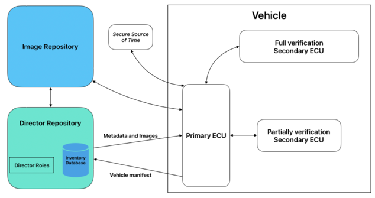

# OTA Obstacle Course: Automotive Update Solutions vs Key Security Challenges: Part 2

In Part 1, we discussed the different ways a secure OTA software update system could be built in a way that provides
all-round protection against a variety of attacks. We explored this theme by taking a simple solution (code signing)
and building it up step-by-step to create a near-optimal solution for the following threats:
* T1: Key Compromise
  * Description: An attacker gains possession of the private key used for signing software updates.
* T2: Distribution Service Compromise
  * Description: An attacker gains control of the software distribution service (either as a
  [Dolev-Yao adversary](https://cseweb.ucsd.edu/classes/sp05/cse208/lec-dolevyao.html) between server and client or by
  gaining code execution on the distribution server itself).
* T3: Rollback Attack
  * Description: An attacker causes an ECU to install a version of software that was previously trusted, but is no
  longer intended to be installed

In this blog, we will introduce the solution that caters to all these threats in an all-inclusive solution. The best
part is that we already implement this at Toradex for Torizon OS and Torizon Cloud!

## Solution 5: Uptane

Uptane, a superset of TUF (The Update Framework) that includes additional features for the unique constraints of the
automotive industry, defines a framework for securely delivering OTA software updates to automobiles, combining all the
principles outlined above. The salient features of Uptane can be summarized as:
* Separation of duties
* Threshold signatures
* Explicit and implicit revocation of keys
* Compromise resilience through use of offline keys and multiple repositories

Although Uptane was designed with the automotive industry's use-case in mind, it perfectly applies to our work at
Toradex.

Uptane’s architecture can be described as having role-based functional separation, multiple repositories and secure
ECUs. Each “role” in Uptane is responsible for generating and signing different kinds of software update metadata. They
are summarized below:
* **The Root Role**: Responsible for generating and signing the Root metadata, which consists of the mapping between all
four roles and their public keys. This activity establishes the root of trust [US NIST Online Glossary] in the software
update system, and can be considered as analogous to a certificate authority in X.509.
* **The Targets Role**: Responsible for generating and signing the Targets metadata, which consists of information about all
software update bundles. This metadata ensures the integrity of the contents of the actual update package. This metadata
is separate from the artefacts, and contains combined information about all the artefacts that are valid targets for
installation. Multiple targets roles can exist on a repository, with a hierarchical relationship, allowing a single
repository to contain software attested by different actors. The top-level Targets role on the Image repository can
delegate the responsibility of signing metadata to other targets roles, and can restrict the signing authority of
delegatees to specific subsets of packages or ECUs.
* **The Snapshot Role**: Responsible for generating and signing the Snapshot metadata, which consists of information about
each Targets metadata file. This metadata ensures the consistency of the repository.
* **The Timestamp Role**: Responsible for generating and signing the Timestamp metadata, which contains information about
the latest Snapshot metadata on the Image repository. This metadata ensures the timeliness of the software update
operations. It typically has a short expiry period, but is very small, containing a single hash of the snapshot
metadata. It also ensures that the most common happy-path operation is efficient; update checks where everything is
already up to date need only verify the timestamp metadata.

An important architectural element in Uptane is the separation of the Image repository and Director repository. These
two repositories support the services that devices communicate with to get software update packages. These two
repositories perform different functions using the four roles (outlined above) that are implemented on them.

* The Image repository has the signed software update packages and their associated signed Uptane metadata (root,
timestamp, snapshot, and targets). This repository acts as the source of ground truth about all software that is
potentially valid to install.
* The Director repository “directs” the vehicle to receive, verify, install, and activate the software update packages,
i.e., it instructs each destination ECU about which individual image should be installed by producing signed metadata on
demand. This repository acts as the source of ground truth about what software (selected from the valid software in the
image repository) each individual vehicle and ECU should install.

The Uptane spec defines a "Primary ECU" and a "Secondary ECU", and that distinction is made based on the varying
computational and communication capabilities of different ECUs present in a vehicle. However, this distinction isn't
really applicable for Toradex's use-case of Uptane. For our use-case, the way Primary ECU is the OS, and the Secondary
ECUs are the individual subsystems within the OS. 

### What does Uptane do that the other solutions don't?

Uptane addresses all of our identified threats (T1, T2, and T3). by providing mechanisms to _explicitly_ and _implicitly_
revoke trust and using _detached combined signatures_. Separate Uptane roles are responsible for signing different types
of security metadata. In Uptane, rather than each individual software update package bearing its own signature, there is
a signed metadata document, referred to as targets metadata, which lists all currently-valid software update packages in
the repository. This metadata file has an expiration time, after which it is not valid. An Uptane destination ECU does
not install a software update package unless it is listed in a valid targets metadata file from the image repository;
metadata can be invalidated implicitly by expiry. Metadata can also be explicitly invalidated, via other roles issuing
metadata that explicitly revoke it. The time-limited validity of metadata allows ECUs to ensure that they are operating
on recently-issued metadata, up to a level of tolerance that can be easily calibrated by choosing appropriate expiry
dates according to the tolerance and risk profile.

Thus, Uptane keeps a software update package’s signature detached from it, and combines it with other signatures of
software update packages that need to be distributed together.

Explicit revocation is also a core feature of Uptane. Each individual Uptane destination ECU on the vehicle stores the
targets metadata that it needs, and updates that metadata every time it checks for an available software update package.
If the Uptane destination ECU receives a newer version of targets metadata, it invalidates and discards the older one,
even if the previous targets metadata had not expired. This explicit revocation of signatures provides an inherently
better mechanism for preventing rollbacks. If a particular update package is determined to be malicious, all targets
metadata containing that update package can be revoked and replaced–without having to revoke keys or update the
firmwares or trust stores of the ECUs. In case the key signing the targets metadata is compromised, it can be rotated
out and explicitly invalidated by updating the root metadata – similar in function to using a CA to revoke a
certificate.

Reviewing Uptane’s posture against the scope of attacks mentioned above,
1. The risk to key compromise (T1) is low due to the offline nature of the root role’s private keys. In case of a key
compromise, an explicit way to rotate/revoke keys is also provided.
2. The risk to distribution service compromise (T2) is low due to the separation of the Image repository and Director,
and the offline nature of the private keys of the root role on the Director. In case of a key compromise, an explicit
way to rotate/revoke keys is also provided.
3. Risk of rollback attacks (T3) is low and easy to implement as it is in-band with the protocol through the explicit
checking of targets metadata version during full verification.

   
   